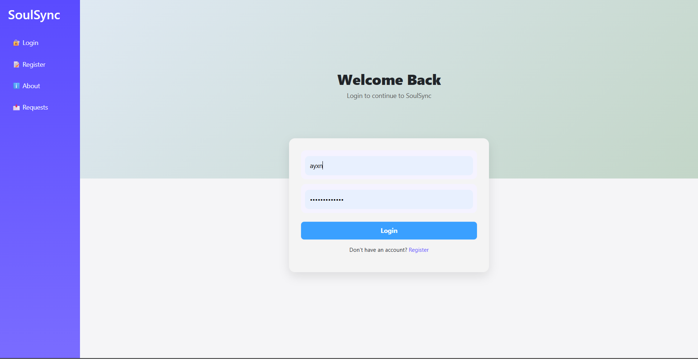
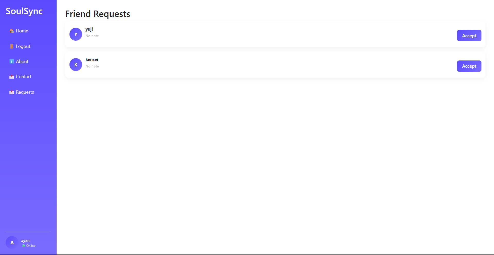
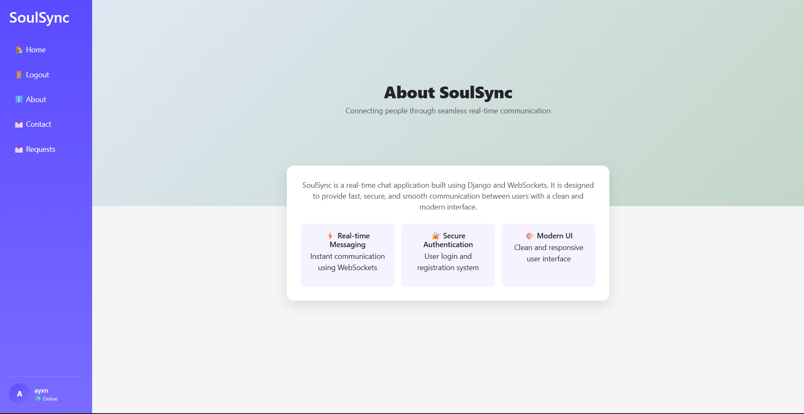

SoulSync is a full-stack real-time chat application built using Django and WebSockets. It allows users to connect, send friend requests, and chat instantly with a modern UI.

---

## 🚀 Features

- 🔐 User Authentication (Login/Register/Logout)
- 👥 Friend Request System (Send, Accept, Notes)
- 💬 Real-Time One-to-One Chat (WebSockets)
- 📂 Persistent Chat History (Database)
- 🔍 User Search Functionality
- 🧑‍🤝‍🧑 Dynamic Friend List
- 🎨 Clean and Responsive UI

---

## 🛠 Tech Stack

- **Backend:** Django, Django Channels, WebSockets  
- **Frontend:** HTML, CSS, JavaScript  
- **Database:** SQLite  
- **Tools:** Git, GitHub  

---

## 📸 Screenshots

### 🏠 Chat Interface


### 👥 Friend Requests


### ➕ Add Friend Popup


### Authentication Page


### Contact Page


### About Page


---

## ⚙️ Installation

```bash
git clone https://github.com/yourusername/soulsync.git
cd soulsync
python -m venv venv
venv\Scripts\activate   # Windows
pip install -r requirements.txt
python manage.py migrate
python manage.py runserver
